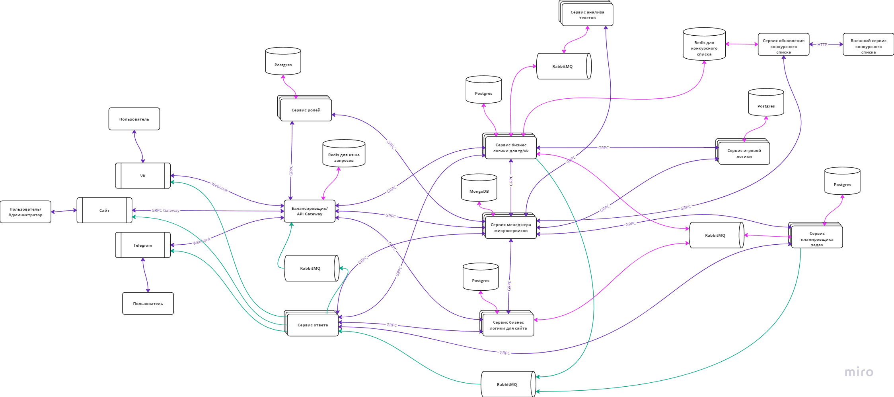

# Первый микросервис gateway
Представляет собой шлюз api gateway.
Принимает все входящие запросы

## Структура проекта

### `cmd`

- `gateway` - основной сервис

### `internal`

- `api` - реализация grpc-методов
- `app` - пакет для запуска приложения
- `server` - компонент grpc-сервера
- `models` - модели базы данных
- `repository` - репозиторий для взаимодействия с базой данных
- `service` - внутренние сервисы
    - `role_service` - передача и анализ данных для сервиса ролей
- `transfer` - передача данных из `service` в нужный микросервис

### `pkg`

- `server_v1` - сгенерированные файлы для grpc
- `logger` - реализация логгера для всего проекта

## Архитектура микросервисов

## Структура репозиториев

- [gateway](https://github.com/StasikLeyshin/gateway) - Api-шлюз
  - [role-service](https://github.com/StasikLeyshin/role-service) - Сервис ролей
  - [manage-service](https://github.com/StasikLeyshin/manage-service) - Сервис менеджера микросервисов

### Вспомогательные репозитории
- [libs-proto](https://github.com/StasikLeyshin/libs-proto) - Хранение proto файлов и сгенерированного кода из них
- [deployment](https://github.com/StasikLeyshin/deployment) - Хранение всех манифестов микросервисов для деплоя
